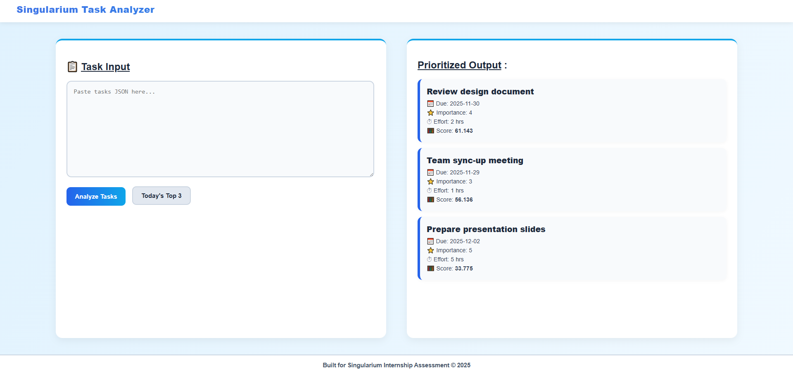

# SMART TASK ANALYZER

A lightweight task prioritization tool powered by **Django REST backend** and **JavaScript frontend**.  
Designed for fast analysis of task lists and intelligent ranking based on urgency, effort, and importance.

---

## Features

- Paste task list as JSON input
- Smart scoring and prioritization algorithm
- Get **Top 3 tasks for today**
- Clean card-based UI output
- No MATLAB, No Python frontend, No heavy libraries
- Minimal, fast and beginner-friendly JavaScript logic

---

## Tech Stack

| Layer | Technology |
|------|------------|
| Backend | :contentReference[oaicite:0]{index=0} + :contentReference[oaicite:1]{index=1} |
| Frontend | :contentReference[oaicite:2]{index=2} + :contentReference[oaicite:3]{index=3} + :contentReference[oaicite:4]{index=4} |
| Database | :contentReference[oaicite:5]{index=5} |
| Version Control | :contentReference[oaicite:6]{index=6} + :contentReference[oaicite:7]{index=7} |

---

## 📁 Project Structure

Smart_Task_Analyzer/

│-- backend/
│ │-- settings.py

            │ │-- urls.py
            
            │ │-- wsgi.py

            │ │-- asgi.py

│-- tasks/
│ │-- views.py
│ │-- urls.py
│ │-- score.py
│ │-- models.py

│-- frontend/
│ │-- index.html
│ │-- styles.css
| |-- frontend/
│   │-- script.js

│-- manage.py

│-- requirements.txt

│-- README.md

---

## Setup and Run

### Clone Repository

git clone <https://github.com/Gondhi-Nesara/UI_Project_SMART_TASK_ANALYSER>

cd Smart_Task_Analyzer

### 2️⃣ Create and Activate Virtual Environment

python -m venv venv

venv\Scripts\activate (Windows)

### 3️⃣ Install Dependencies

pip install -r requirements.txt


### 4️⃣ Run Server

python manage.py runserver


### 5️⃣ Open in Browser

http://127.0.0.1:8000/

---

##  Input JSON Format Example

```json
[
  {
    "title": "Finish project documentation",
    "due_date": "2025-12-01",
    "importance": 5,
    "estimated_hours": 3
  },
  {
    "title": "Prepare for internship interview",
    "due_date": "2025-11-30",
    "importance": 4,
    "estimated_hours": 2
  },
  {
    "title": "Team sync-up call",
    "due_date": "2025-11-30",
    "importance": 3,
    "estimated_hours": 1
  }
]

```
---

## Output

- Analyzed tasks return sorted with a smart score
- Top 3 tasks are suggested via the /suggest/ API
- Results displayed in clean UI cards

---



---
<!-- 
## Author

Gondhi Nesara
Electronics and Communication Engineering Graduate
JSS Academy of Technical Education, Bengaluru

--- -->
<!-- 
## Repository

Managed on GitHub

--- -->

## Future Scope

- AI-based suggestion improvement
- Mobile app extension
- Integration with browsers/task managers
- Hardware/SoC acceleration (VLSI path)

---

## Support

If you face issues:
- Static files not loading → Check STATICFILES_DIRS
- Functions not working → Open via server root, not static folder
- 404 errors → Verify urls.py paths

---

## Notes

- Ensure static file paths are properly configured in settings.py
- API endpoints must be accessed while server is running
- JSON must be valid array format
- Designed for beginners for easy understanding + interview use
